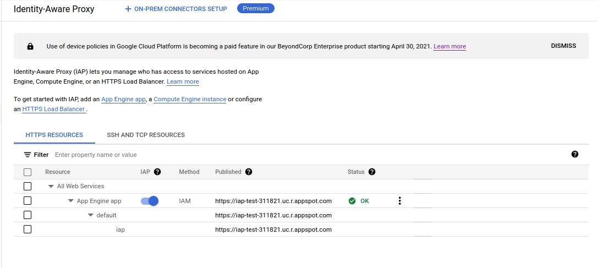
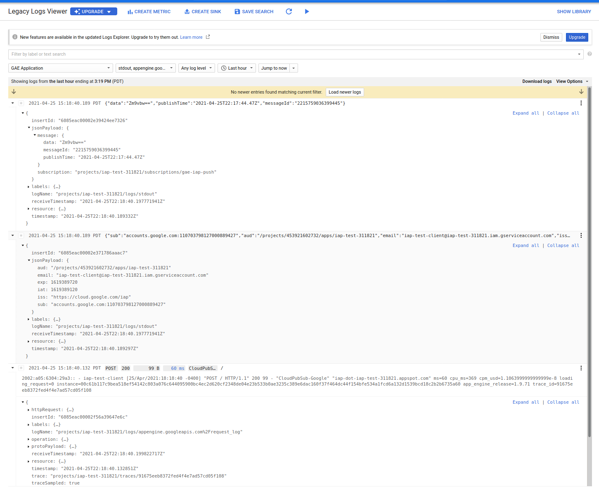

## Google PubSub Authenticated Push Notification through IAP

Tutorial on how to setup a simple AppEngine application that will receive [authenticated push notification](https://cloud.google.com/pubsub/docs/push#authentication_and_authorization_by_the_push_endpoint) though IAP:

`client` --> `PubSub` --> `HTTP Push` --> `IAP` --> `AppEngine`

Note that you can already emit authenticated requests to AppeEngine or Cloud Run by directly invoking the service by granting PubSub the requisite permissions:

[PubSub -> AppEngine/Cloud Run Authentication](https://cloud.google.com/pubsub/docs/push#authentication_and_authorization_by_the_push_endpoint)

> "Cloud Run and App Engine automatically authenticate HTTP calls by verifying Pub/Sub-generated tokens. The only configuration required of the user is that the necessary IAM roles be granted to the caller account. For example, you can authorize or revoke permission to call a particular Cloud Run endpoint for an account.

However, if you inject IAP in the mix, you can apply [Access Context Manager](https://cloud.google.com/access-context-manager/docs/overview) and [Conditions](https://cloud.google.com/iam/docs/conditions-overview).   While this tutorial describes AppEngine as the backend, you are also free to use IAP and Google Loadbalancer to target any other backend type: (`client` --> `PubSub` --> `HTTP Push` --> `GCP HTTP Load Balancer` -->  `IAP` --> `BackendService`)

Anyway, to get started

---

### Setup

First setup some environment variables and a service account that the PubSub service will authenticate as.  This is also the same service account that will be granted access through IAP

```bash
export PROJECT_ID=`gcloud config get-value core/project`
export PROJECT_NUMBER=`gcloud projects describe $PROJECT_ID --format='value(projectNumber)'`

gcloud iam service-accounts create iap-test-client --display-name "Test Client for IAP Service Account"

# assign yourself permissions to impersonate this service account...this is just for testing
gcloud iam service-accounts \
  add-iam-policy-binding iap-test-client@$PROJECT_ID.iam.gserviceaccount.com \
  --member=user:`gcloud config get-value core/account` --role=roles/iam.serviceAccountTokenCreator
```

### AppEngine

Now configure and deploy AppEngine

edit `server.go`, specify the `allowedAudience` variable to `/projects/$PROJECT_NUMBER/apps/$PROJECT_ID`

In my case, the value looked like

```golang
	allowedAudience = flag.String("allowedAudience", "/projects/248066739582/apps/clamav-241815", "Audience to allow")
```

Now deploy the application:

```bash
gcloud app create --region us-central
gcloud app deploy --version iap --no-promote -q
export URL=`gcloud app versions describe iap --service default  --format="value(versionUrl)"`
```

Find the `client_id` and secret used by IAP

```bash
gcloud alpha iap oauth-brands create --application_title="IAP_App" --support_email=`gcloud config get-value core/account`

$ gcloud alpha iap oauth-brands list  

    applicationTitle: IAP_App
    name: projects/453921602732/brands/453921602732
    orgInternalOnly: true
    supportEmail: you@domain.com

# the bit you need from here is the brand
export BRAND=`gcloud alpha iap oauth-brands list  --format="value(name.scope('brands'))"`
```

Now go to the cloud consone and enable IAP for the appengine app:

Enable IAP



Once enabled, note down the client_id and secret:

```bash
$ gcloud alpha iap oauth-clients  list $BRAND
    displayName: IAP-App-Engine-app
    name: projects/453921602732/brands/453921602732/identityAwareProxyClients/453921602732-v6268n7ass0luckjm21gjgh0so99hrrd.apps.googleusercontent.com
    secret: SV2WosHm0agaiTClRNCdwJff

export CLIENT_ID=`gcloud alpha iap oauth-clients  list $BRAND --format="value(name.scope('identityAwareProxyClients'))"`
export CLIENT_SECRET=`gcloud alpha iap oauth-clients  list $BRAND --format="value(secret)"`
echo $CLIENT_ID
echo $CLIENT_SECRET
```

ok, now see if you can access the app using your id_token from gcloud:

```bash
export ID_TOKEN=`gcloud auth print-identity-token`
curl -s -H "Authorization: Bearer $ID_TOKEN" $URL

   Invalid IAP credentials: JWT audience doesn't match this application ('aud' claim (32555940559.apps.googleusercontent.com) doesn't match expected value (453921602732-v6268n7ass0luckjm21gjgh0so99hrrd.apps.googleusercontent.com))
```

This wont' work and thats expected...we're not sending in the correct id_token with the correct audience...so lets try to do that

```bash
export ID_TOKEN=`gcloud auth print-identity-token --include-email --audiences=$CLIENT_ID --impersonate-service-account iap-test-client@$PROJECT_ID.iam.gserviceaccount.com`

curl -s -H "Authorization: Bearer $ID_TOKEN" $URL
     IAP_App: Access denied for user iap-test-client@iap-test-311821.iam.gserviceaccount.com requesting https://iap-dot-iap-test-311821.appspot.com/. If you should have access, contact admin@esodemoapp2.com and include the full text of this message.
```

Now, the error is different, we need allow the service account access through to IAP:

```bash
gcloud alpha iap web add-iam-policy-binding \
  --member="serviceAccount:iap-test-client@$PROJECT_ID.iam.gserviceaccount.com" \
  --role=roles/iap.httpsResourceAccessor  --resource-type=app-engine
```

wait maybe 2mins and try the url again:


```bash
curl -s -H "Authorization: Bearer $ID_TOKEN" $URL | jq '.'

    {
    "email": "iap-test-client@iap-test-311821.iam.gserviceaccount.com",
    "aud": "/projects/453921602732/apps/iap-test-311821",
    "exp": 1619389605,
    "iat": 1619389005,
    "iss": "https://cloud.google.com/iap",
    "sub": "accounts.google.com:110703798127000889427"
    }
```

thats good, what wer'e seeing in the response is the decoded claims for the `X-Goog-Iap-Jwt-Assertion` header.

now on to pubsub:

#### Pubsub


```bash
# crate a topic that we will get messages and push subscribe
gcloud pubsub topics create iap-topic

# assign pubsub permissions to impersonate the service account and then get 
# and id_token for

gcloud iam service-accounts \
   add-iam-policy-binding iap-test-client@$PROJECT_ID.iam.gserviceaccount.com \
   --member=serviceAccount:service-$PROJECT_NUMBER@gcp-sa-pubsub.iam.gserviceaccount.com \
   --role=roles/iam.serviceAccountTokenCreator

# now create the subscription and associate the service account with it
gcloud pubsub subscriptions create gae-iap-push \
 --topic=iap-topic \
 --push-endpoint="$URL"	 \
 --push-auth-service-account="iap-test-client@$PROJECT_ID.iam.gserviceaccount.com" \
 --push-auth-token-audience=$CLIENT_ID

# submit a sample message to the topic
gcloud pubsub topics publish iap-topic  --message=fooo
```

In the appengine logs, you'll see that the message got through...and the decoded PubSub Message and JWT header that GAE received

